# 3DOG: Go2 + VLP-16 자율 3D 탐사

연세대 PRAXIS 실전문제연구팀 **3DOG** (사회기반시스템종합설계 후속).
4족 로봇 Unitree Go2에 Velodyne VLP-16을 달아 공장·창고를 스스로 돌아다니며 **3D 지도**를 만드는 것이 목표다.
RTX 5090 한 대에서 Isaac Sim 6.0.1 / Isaac Lab 3.0으로 시뮬레이션하고, 자율탐사 정책은 ARiADNE(RA-L 2024)를
출발점으로 **4족 회전 비용 + 3D 표면 커버리지** 보상으로 재학습한다. 다음 단계는 sim-to-real이다.

### 보행 학습: Isaac Lab에서 PPO, 4096마리 병렬
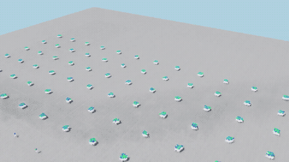

### 학습 단계별 보행 (평지, 36마리 고정 시점)
**① 학습 초기: 못 걸음**
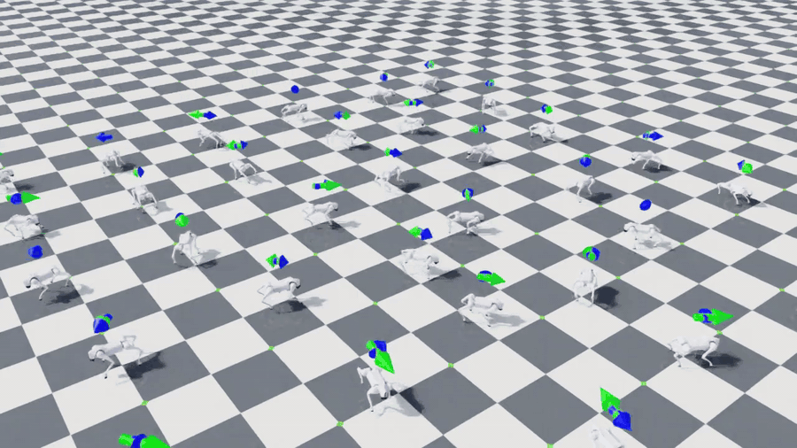

**② 50 iteration: 이상하게 걸음**
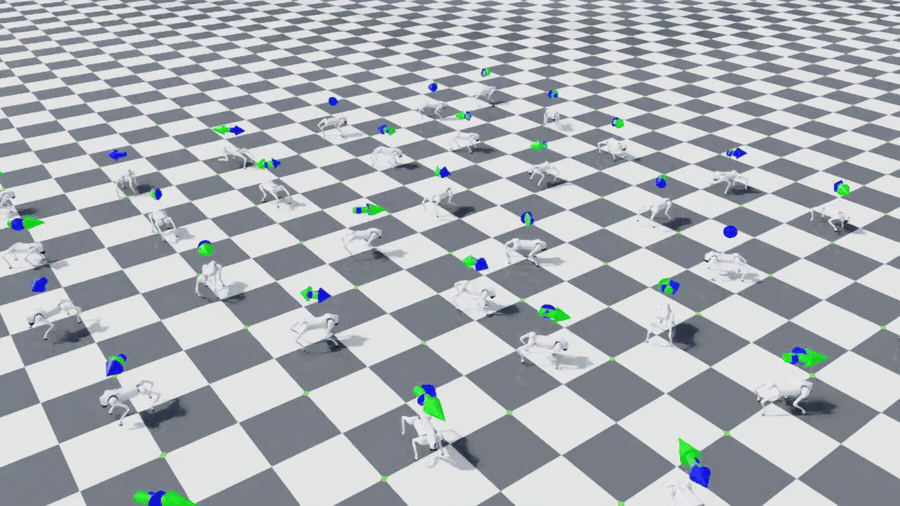

**③ 1500 iteration: 잘 걸음**
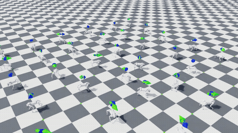

**④ 학습이 끝난 정책으로 4096마리**
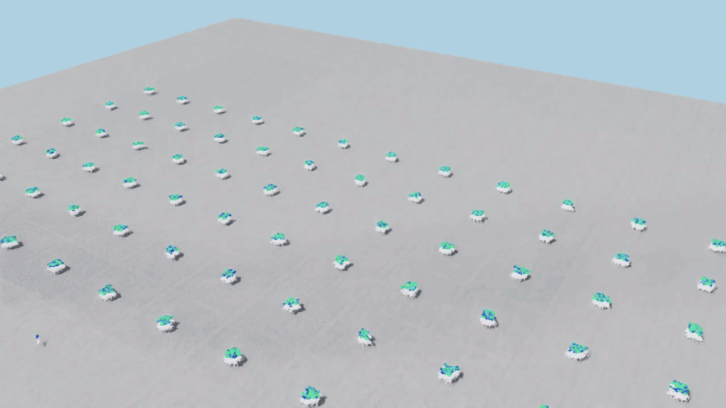

### VLP-16 스캔 (Go2 등에 장착, 16채널 링)
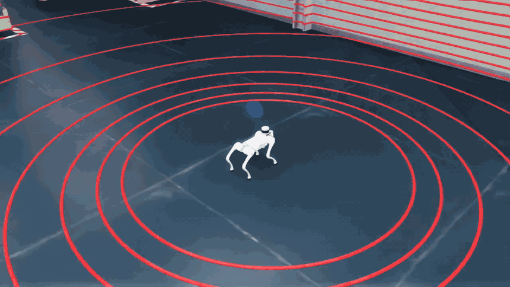

### ARiADNE 자율탐사 1마리 (왼쪽 시뮬, 오른쪽 실시간 2D 지도 + 그래프, 4배속)
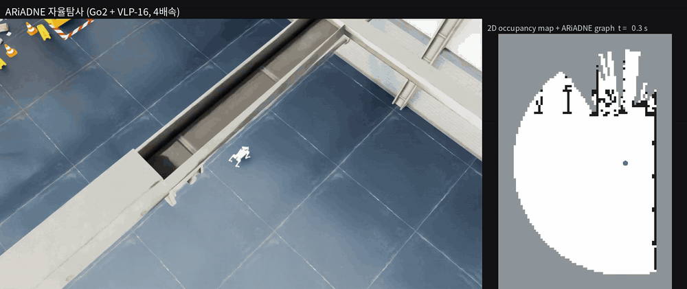

### 16마리 독립 탐사 + 끝나면 랜덤 리스폰 (오른쪽: 로봇별 개별 지도, 4배속)
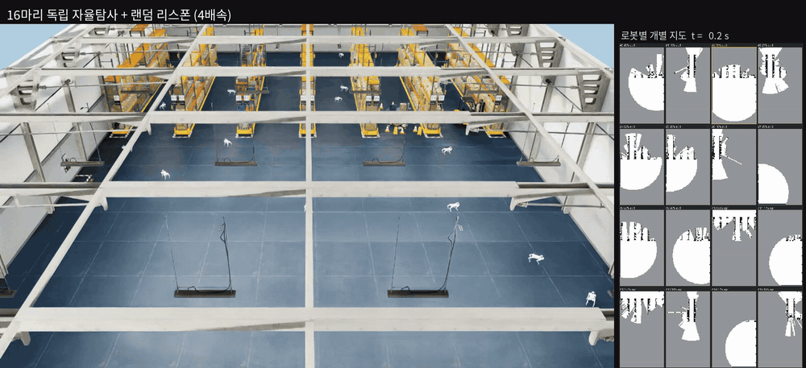

원본 영상(mp4)은 [media/](media/)에 있다.

## 파이프라인

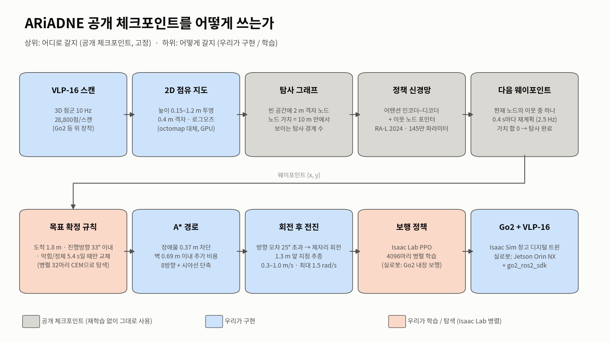

VLP-16 → GPU 점유격자(0.4 m) → ARiADNE 그래프 정책(다음 노드 선택) → A* 경로 → turn-then-go 추종 → PPO 보행 정책.
역할 분담: **Isaac Sim** = 물리·센서·창고 환경, **Isaac Lab** = 병렬 학습/평가 도구(보행 PPO, 병렬 탐사, 파라미터 탐색),
**ariadne3d** = 자율탐사 정책 재학습(SAC).

## 진행 현황과 지표

| # | 단계 | 결과 |
|---|---|---|
| 1 | 보행 정책 (PPO, 4096 병렬, 1500 iter) | 속도 추종 오차 0.06 m/s, 에피소드 99.5 %가 넘어지지 않고 종료 |
| 2 | 2D 자율탐사 (ARiADNE + A* + turn-then-go) | 창고 탐사 완료 ~95–125 s, 지도 precision 100 %, recall 99.7 %, false-free 0.77 % |
| 3 | 16마리 병렬 + CEM 파라미터 탐색 | 48쌍 비교: 완료 시간 95 vs 102 s, 완료율 100 vs 96 %, recall 0.988 vs 0.975 |
| 4 | VLP-16 노이즈 모델 + deskew | 노이즈만: precision 96.1 % → deskew 후 이상적 센서와 동등 |
| 5 | 3D 지도 평가 (0.1 m 복셀 vs 창고 메시) | **2D 96.7 %일 때 3D 77.0 %**, 천장 50 %, 정확도 4.9 cm — [3D 뷰어](results/map3d_viewer_tilt0.html) |
| 6 | VLP-16 마운트 기울기 | 같은 경로 15°: 3D 76.9 → **89.5 %**, 앞쪽 저상 장애물 검출 유지 (20° 이상은 상실). 실제 탐사: 2D 완료 시점 3D 70.5 → **81.7 %** |
| 7 | ARiADNE 재학습 1차 (회전 비용 + 3D 보상) | 학습 미사용 지도 60장: 2D 탐사 실패 **10 → 1**, 총 시간 −7.4 % (95 % CI −13…−1), 회전 −7.5 %, 3D는 차이 없음 |
| 8 | 창고 이식 점검 (진행 중) | 학습 지도(넓은 방)와 창고(3 m 통로)의 차이로 두 정책 모두 창고 2D 완료율 낮음 → 창고형 절차 생성 맵으로 2차 학습 예정 |

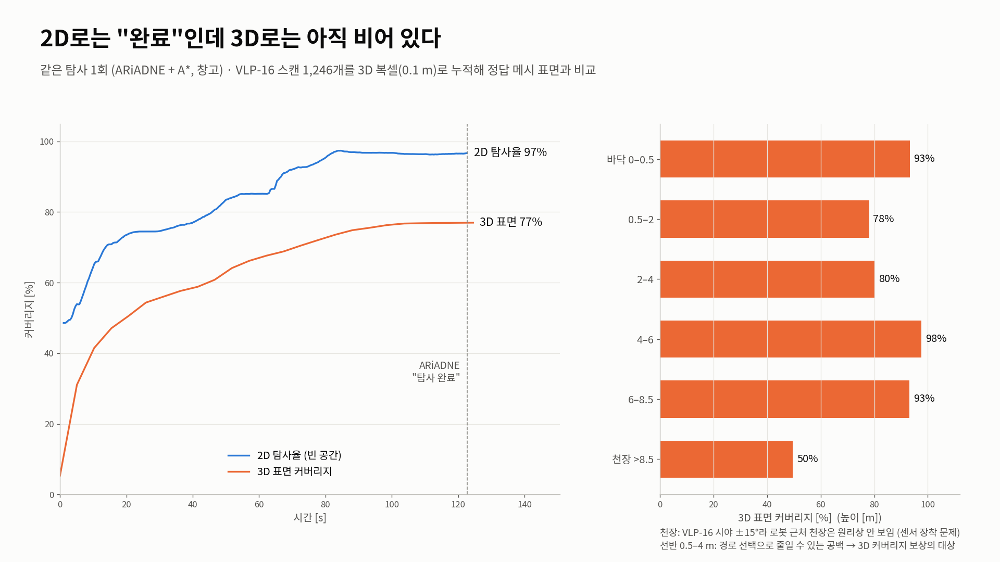
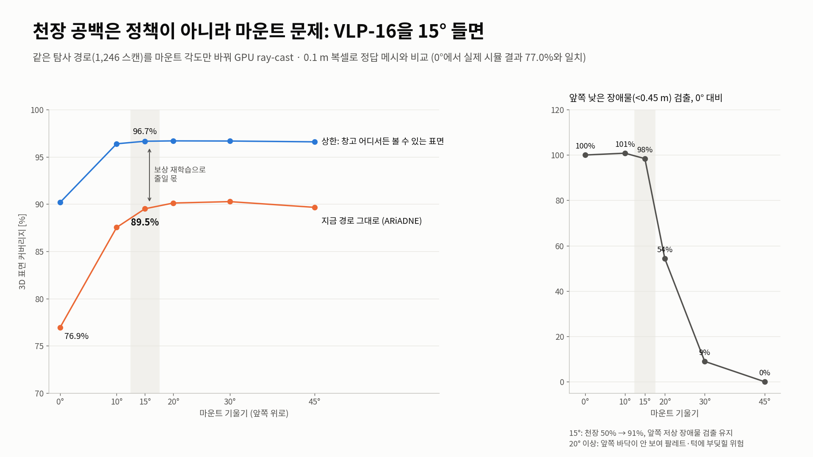

## 재학습 보상 (그래프 한 스텝)

```
r = frontier 보상 (ARiADNE 원본)  −  t / 16  +  (새로 본 벽·천장 면적) / 250 m²   (+20: 2D 완료)
t = |Δψ| / 1.5 rad/s  +  0.5 s · [|Δψ| > 0.44 rad]  +  이동거리 / 1.0 m/s        (Go2 turn-then-go 시간)
```
회전이 없으면 원본의 `−거리/16`과 같다. 노드 입력에 **회전 비용**(노드 방향과 heading 차이)과 **3D 효용**
(그 위치에서 시야에 들어오는 미관측 표면)을 추가했고, 공개 체크포인트에서 새 입력 가중치 0으로 시작한다.
2D 완료 후에도 3D 효용이 남아 있으면 계속 탐사한다. 자세한 내용: [ariadne3d/README.md](ariadne3d/README.md),
[figures/fig3_paper_vs_ours.png](figures/fig3_paper_vs_ours.png).

## 폴더

| 경로 | 내용 |
|---|---|
| `go2_lab/` | Isaac Lab 태스크: 보행(`locomotion.py`), 창고·VLP-16(`factory.py`), 탐사 명령·점유격자·A*·병렬 평가(`exploration/`) |
| `ariadne3d/` | ARiADNE 재학습: 2.5D 세계, 기울인 VLP-16, 3D belief/효용, SAC 학습·평가 |
| `tools/` | 3D 지도 평가(`map3d.py`), 마운트 실험, 그림·영상 생성, USD 변환 |
| `results/` | 지표 원자료 (JSON/CSV), 3D 지도 뷰어 HTML |
| `weights/` | 보행 정책 `go2_factory_walk_model_1499.pt`, 재학습 탐사 정책 `ariadne3d_go2_turn_3d_ep4000_policy.pth` |
| `media/`, `figures/` | 영상, 발표 그림 |
| `docs/SIM_GUIDE.md` | 시뮬레이터 사용법·환경변수·문제 해결 기록 |

## 실행

환경: Ubuntu, RTX 5090 (sm_120), Isaac Sim 6.0.1 + Isaac Lab 3.0 (develop), conda env `isaac` (Python 3.12, torch 2.11 cu128).

```bash
./run.sh walk-play          # 보행 정책 재생
./run.sh explore            # ARiADNE 자율탐사 1마리 + 실시간 2D 지도 패널
./run.sh loop               # 16마리 독립 탐사, 끝나면 랜덤 리스폰
GO2_LIDAR_TILT=15 ./run.sh explore                    # VLP-16 15° 마운트
python ariadne3d/driver3d.py --episodes 4000          # 탐사 정책 재학습 (~6 h)
python ariadne3d/eval3d.py <ckpt...> --n 60           # 평가
```
리포에 포함하지 않은 것: NVIDIA 창고·Go2 USD(`assets/warehouse`, `assets/go2_stock`, Isaac 에셋 서버에서 받음),
`third_party/` 원본 코드, 학습 로그. 받는 방법은 [docs/SIM_GUIDE.md](docs/SIM_GUIDE.md).

## 다음 단계

1. 창고형 절차 생성 맵(랙·통로) + 2 m 노드로 2차 재학습, 랙 내부(선반 층) 3D 모델링
2. Isaac Go2 창고에서 ROS 플래너 / 원본 / 재학습 정책 병렬 비교 (`GO2_COMPARE=planner`, 연동 코드 준비됨)
3. 실제 Go2 + VLP-16 (마운트 15° 브래킷), SLAM 위치추정 연동, sim-to-real

## 출처

- ARiADNE: Cao et al., RA-L 2024 — [marmotlab/ARiADNE-ROS-Planner](https://github.com/marmotlab/ARiADNE-ROS-Planner),
  학습 코드 [marmotlab/large-scale-DRL-exploration](https://github.com/marmotlab/large-scale-DRL-exploration)
  (`ariadne3d/`의 agent·env·model 등은 이 코드의 사본을 기반으로 확장, 라이선스 표기 없음 → 공개 전 확인 필요)
- Go2 URDF: [unitreerobotics/unitree_ros](https://github.com/unitreerobotics/unitree_ros), VLP-16 마운트:
  [anujjain-dev/unitree-go2-ros2](https://github.com/anujjain-dev/unitree-go2-ros2),
  VLP-16 메시: [ToyotaResearchInstitute/velodyne_simulator](https://github.com/ToyotaResearchInstitute/velodyne_simulator)
- [Isaac Lab](https://github.com/isaac-sim/IsaacLab), NVIDIA Isaac Sim 창고 에셋
