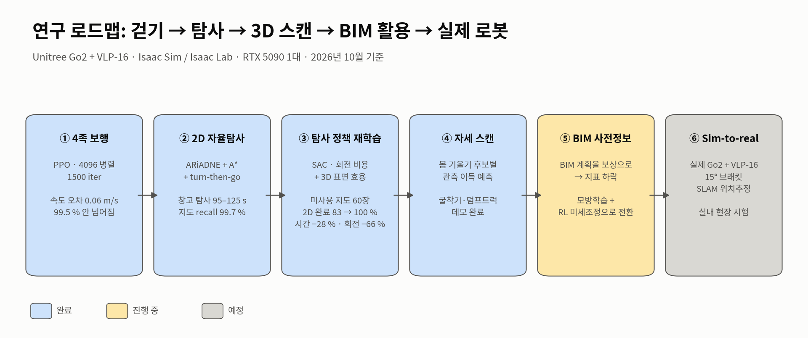
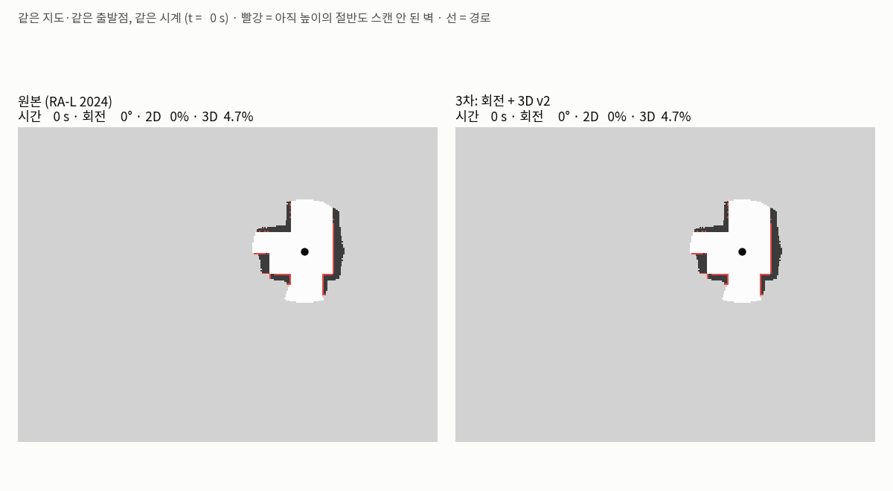
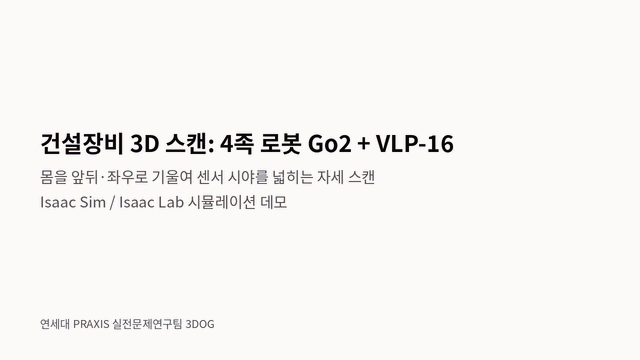
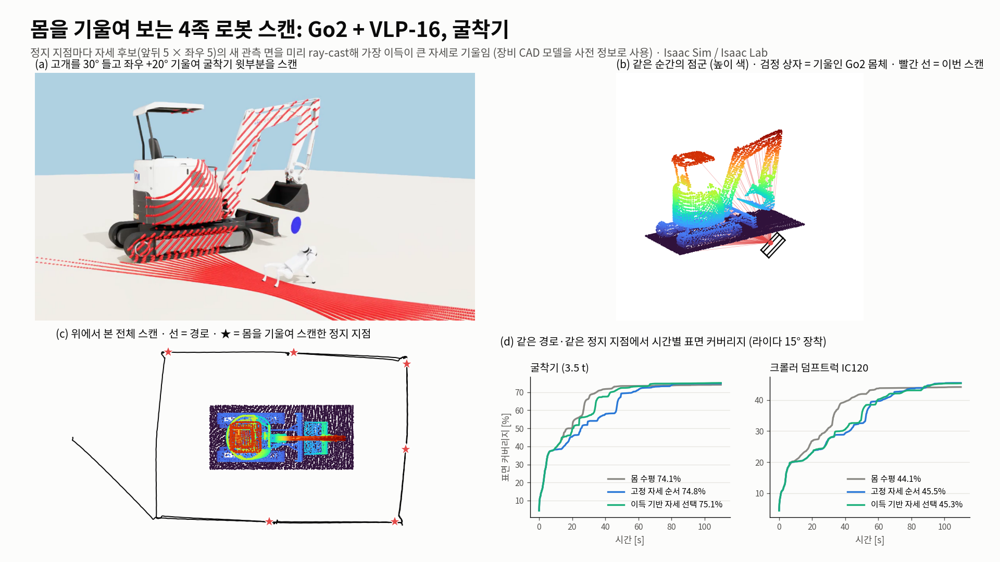
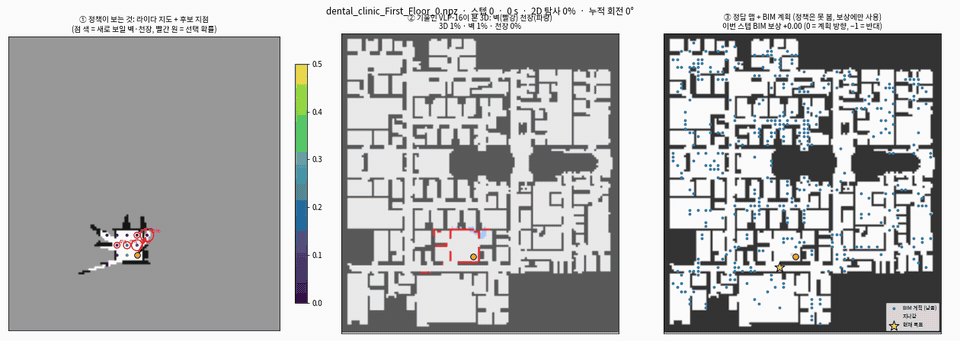
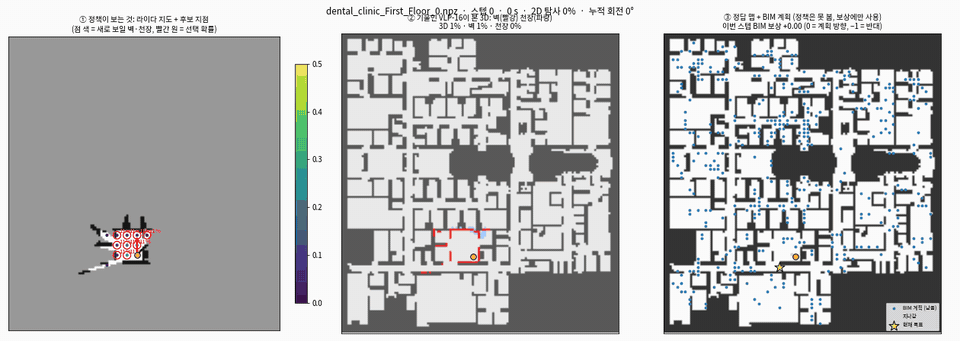
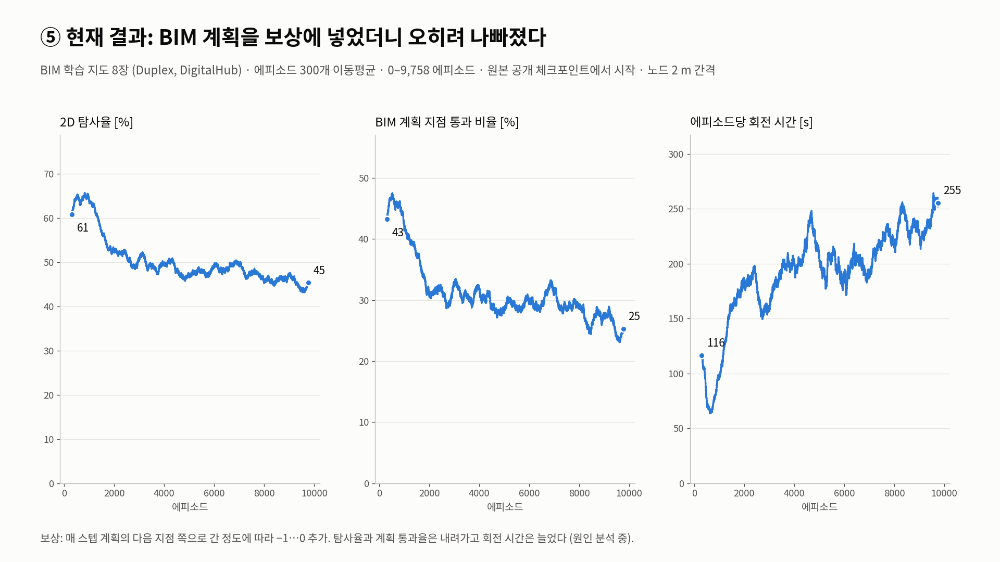
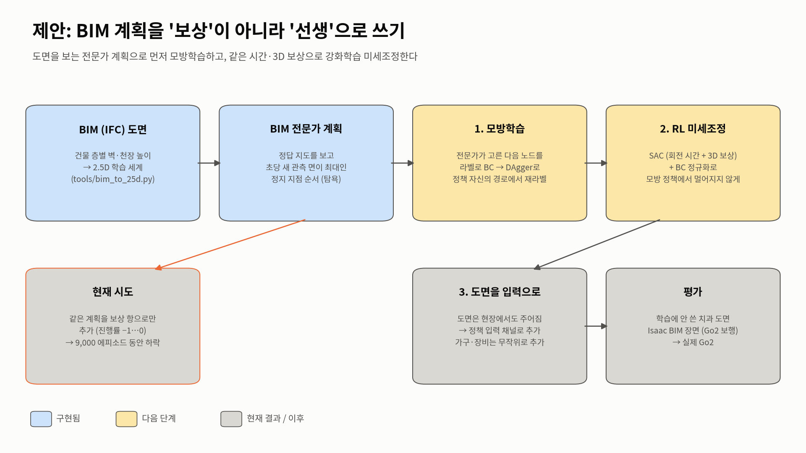

# 3DOG-BIM: 도면을 아는 4족 로봇의 자율 3D 스캔

연세대 PRAXIS 실전문제연구팀 **3DOG** · `bim` 브랜치 · 2026년 10월 7일 기준

4족 로봇 Unitree Go2에 VLP-16 라이다를 달아, 건물을 스스로 돌아다니며 **벽·천장까지 빠짐없는 3D 지도**를 만드는
탐사 정책을 강화학습으로 만든다. 실내·건설 현장에는 대부분 **BIM 도면**이 있다. 이 브랜치의 질문은
**"도면을 미리 알고 있다면, 탐사 정책을 어떻게 학습시켜야 더 빨리, 덜 돌면서, 빠짐없이 스캔할까?"** 이다.



| 단계 | 상태 | 핵심 결과 |
|---|---|---|
| ① 4족 보행 (PPO, 4096 병렬) | 완료 | 속도 추종 오차 0.06 m/s, 에피소드 99.5 %가 넘어지지 않고 종료 |
| ② 2D 자율탐사 (ARiADNE + A* + turn-then-go) | 완료 | Isaac 창고 탐사 95–125 s, 지도 recall 99.7 % |
| ③ 탐사 정책 재학습 (SAC, 회전 비용 + 3D 효용) | 완료 | 학습에 안 쓴 지도 60장: 2D 완료 83 → **100 %**, 회전 **−66 %** |
| ④ 몸을 기울이는 자세 스캔 | 데모 | 굴착기·덤프트럭 스캔, 최종 커버리지 차이는 작음 (아래) |
| ⑤ BIM 사전정보 활용 | **진행 중** | BIM 계획을 보상에 넣는 방식은 실패 → 모방학습 + RL로 전환 |
| ⑥ Sim-to-real | 예정 | 실제 Go2 + VLP-16 (15° 브래킷), SLAM 위치추정 |

①–②의 영상과 세부 지표는 [`main` 브랜치 README](https://github.com/gkgk0119gmail-arch/3DOG_Go2-exploration/tree/main)에 있다.

---

## 지금까지: 탐사 정책을 4족 로봇에 맞게 다시 학습 (③)

공개된 그래프 기반 탐사 정책 ARiADNE(RA-L 2024)는 바퀴 로봇 기준이라 **방향 전환 비용**이 없고 **2D 지도**만 본다.
Go2는 제자리에서 돌아야 하고(약 1.5 rad/s), 라이다가 15° 위로 기울어 있어 이동 방향에 따라 보이는 벽·천장이 달라진다.
그래서 보상과 노드 입력을 바꿔 공개 체크포인트에서 SAC로 재학습했다.

```
r = frontier 보상 (원본)  −  t / 16  +  (새로 본 벽·천장 면적) / 250 m²   (+20: 2D 완료)
t = |Δψ| / 1.5 rad/s  +  0.5 s · [|Δψ| > 0.44 rad]  +  이동거리 / 1.0 m/s     (Go2 turn-then-go 시간)
```

노드 입력에는 **회전 비용**(노드 방향과 현재 heading의 차이)과 **3D 효용**(그 노드에서 360° 둘러볼 때
시선이 닿는 미관측 벽·천장 면적)을 추가했다. 새 입력의 가중치는 0에서 시작하고, critic은 정답 지도를 본다
(ARiADNE와 같은 asymmetric actor-critic).

**학습에 안 쓴 지도 60장** (greedy, 라이다 15°, 노드 4 m 간격, 평균은 미완료 지도 포함):

| 정책 | 2D 탐사 완료 | 종료 시간 | 누적 회전 | 최종 3D 커버리지 |
|---|---|---|---|---|
| 원본 공개 체크포인트 | 83 % | 649 s | 7,235° | 95.1 % |
| 재학습 (1,500 에피소드) | **100 %** | **467 s (−28 %)** | **2,426° (−66 %)** | 96.7 % |



한계: 같은 정책을 실제 Isaac 창고(3 m 통로, 2 m 노드)에 옮기면 2D 완료가 0 → 25 %에 그친다.
학습 지도와 실제 건물 구조의 차이가 크다는 뜻이고, 이것이 ⑤에서 **실제 건물 도면(BIM)으로 학습**하는 이유다.

## 지금까지: 몸을 기울여 보는 자세 스캔 (④)

장비 CAD 모델을 사전 정보로 쓰고, 정지 지점마다 몸 기울기 후보 25개(앞뒤 5 × 좌우 5)의 새 관측 면을 ray-cast로
미리 계산해 이득이 가장 큰 자세로 기울인다. 기울기 명령을 따라가는 보행 정책은 PPO로 따로 학습했다
(`weights/go2_posture_walk_model_1999.pt`).





같은 경로·같은 정지 지점 기준 최종 표면 커버리지는 굴착기 74.1 → 75.1 %, 덤프트럭 44.1 → 45.3 %로 차이가 작다.
경로 자체가 고정돼 있어서 자세만으로 얻을 수 있는 몫이 작았고, 경로와 자세를 함께 고르는 쪽이 다음 과제다.

---

## 지금: BIM 사전정보로 탐사 정책 유도 (⑤)

### 만든 것

| 구성 | 내용 | 코드 |
|---|---|---|
| IFC → 2.5D 학습 세계 | 층별 벽·가구 높이와 천장 높이 (0.4 m 격자). 학습 8장 (Duplex, DigitalHub), 평가 3장 (치과 의원) | `tools/bim_to_25d.py` |
| IFC → Isaac Sim 장면 | 같은 도면을 Go2가 실제로 걸어 다닐 수 있는 장면으로 변환 | `tools/ifc_to_isaac.py`, `go2_lab/bim.py` |
| BIM 전문가 계획 | 정답 지도를 보고 "초당 새로 보이는 벽·천장 면적"이 가장 큰 정지 지점을 탐욕적으로 고른 순서. 로봇이 현장에서 실행할 수 없는 **상한선** | `ariadne3d/bim_expert.py` |
| 가이드 보상 | 매 스텝 계획의 다음 지점 쪽으로 간 정도에 따라 −1…0을 보상에 더함. 정책은 계획을 보지 못함 | `ariadne3d/bim_env.py` |

### 결과: 보상으로 넣었더니 오히려 나빠졌다

학습에 안 쓴 치과 1층 도면, 200 스텝. 왼쪽부터 정책이 보는 지도 · 3D 관측 · 정답 지도와 BIM 계획(파란 점).

**학습 전 (원본 정책)**: 2D 77 %, 3D 75 %


**BIM 가이드 보상으로 1,500 에피소드 학습 후**: 2D 7 %, 3D 8 %




약 9,800 에피소드 동안 학습 지도에서의 2D 탐사율(61 → 45 %)과 계획 지점 통과율(43 → 25 %)이 내려가고
회전 시간(116 → 255 s)은 늘었다. 원인은 분석 중이고, 지금 가설은 셋이다.

1. **정보 비대칭**: 계획은 정답 지도를 보고 만들었는데 정책은 자기가 본 지도만 본다. 정책이 볼 수 없는 방향을
   보상으로 요구하는 셈이라, 보상이 "따라갈 수 있는 신호"보다 잡음에 가깝다.
2. **보상 부호**: 가이드 항은 항상 0 이하라서, 기존 frontier·3D 보상과 섞이면 탐사로 얻는 이득을 지운다.
3. **학습 지도 수**: BIM 학습 지도가 8장뿐이라 일반화할 만큼 다양하지 않다.

## 다음 계획: BIM 계획을 보상이 아니라 선생으로



1. **모방학습 (BC → DAgger)**: 전문가 계획이 고른 다음 노드를 라벨로, 정책은 자기 지도만 보고 따라 하도록
   지도학습한다. 정책이 스스로 간 경로에서 전문가에게 다시 물어 라벨을 붙여(DAgger) 분포 차이를 줄인다.
   가설 1(정보 비대칭)을 정면으로 다루는 방법이다: 정책이 볼 수 없는 정보를 보상이 아니라
   "그 상황에서 무엇을 했어야 하는가"로 증류한다 (teacher–student).
2. **RL 미세조정**: ③과 같은 시간·3D 보상으로 SAC 미세조정하되, BC 손실을 정규화로 남겨
   모방한 행동에서 갑자기 멀어지지 않게 한다.
3. **도면을 입력으로**: 도면은 현장에서도 주어지는 정보다. 정책 입력에 도면 채널을 추가하고,
   도면에 없는 가구·장비를 학습 중 무작위로 넣어 **도면과 현장이 다를 때**도 버티게 한다.
4. **평가**: 학습에 안 쓴 치과 도면에서 시간에 따른 2D·3D 커버리지를 비교한다.
   비교 대상은 원본 ARiADNE, ③ 재학습 정책, BIM 전문가(상한선), 제안 방법이다.
   이어서 Isaac BIM 장면에서 실제 보행 정책으로 검증하고, 실제 Go2로 옮긴다 (⑥).

### 연구 질문

- **사전 지도(BIM)를 탐사 정책에 넣는 가장 좋은 방법은 무엇인가?** 보상 shaping, 전문가 모방, 관측 입력을 같은
  환경·같은 예산에서 비교한다.
- **정답을 보는 전문가에서 정답을 못 보는 정책으로 무엇이 얼마나 옮겨지는가?** 전문가 대비 성능 비율을
  도면–현장 차이의 크기별로 측정한다.
- **로봇 동역학 비용(4족 회전, 몸 자세)을 고수준 탐사 정책이 얼마나 반영해야 하는가?** ③의 회전 비용,
  ④의 자세 선택을 하나의 계층형 정책으로 묶는다.

---

## 구성과 실행

| 경로 | 내용 |
|---|---|
| `ariadne3d/` | 탐사 정책 재학습 (SAC): 2.5D 세계, 기울인 VLP-16, 3D 효용, BIM 세계·전문가 (`bim_env.py`, `bim_expert.py`) |
| `go2_lab/` | Isaac Lab 태스크: 보행, 자세 보행(`posture.py`), 장비 스캔(`excavator.py`, `adaptive_scan.py`), BIM 장면(`bim.py`) |
| `tools/` | IFC 변환(`bim_to_25d.py`, `ifc_to_isaac.py`), 커버리지 평가, 그림·영상 생성 (`make_plan_figures.py`: 이 README의 새 그림) |
| `plan/` | 이 README의 그림과 GIF |
| `weights/` | 보행·자세 보행 정책, ③ 탐사 정책 |

환경: Ubuntu, RTX 5090, Isaac Sim 6.0.1 + Isaac Lab 3.0, conda env `isaac` (Python 3.12, torch 2.11 cu128).

```bash
python tools/bim_to_25d.py assets/bim_ifc/dental_clinic.ifc ariadne3d/maps_test       # IFC → 2.5D 세계
./run.sh bim-demo                                                                     # Isaac 치과 장면 + Go2 + VLP-16

cd ariadne3d
ARIADNE_BIM_DIR=maps_train python driver3d.py --world bim --node_res 2 --name bim_guide --episodes 12000
ARIADNE_BIM_DIR=maps_test python eval3d.py pretrained/ariadne_ral2024.pth model/bim_guide/checkpoint.pth \
    --world bim --node_res 2 --n 3
```

리포에 포함하지 않은 것: NVIDIA 창고·Go2 USD, `third_party/` 원본 코드, 학습 로그·체크포인트.
받는 방법은 [docs/SIM_GUIDE.md](docs/SIM_GUIDE.md).

## 출처

- ARiADNE: Cao et al., RA-L 2024 — [marmotlab/ARiADNE-ROS-Planner](https://github.com/marmotlab/ARiADNE-ROS-Planner),
  학습 코드 [marmotlab/large-scale-DRL-exploration](https://github.com/marmotlab/large-scale-DRL-exploration)
  (`ariadne3d/`의 agent·env·model 등은 이 코드의 사본을 기반으로 확장, 라이선스 표기 없음 → 공개 전 확인 필요)
- BIM: 공개 IFC 예제 모델 (Duplex, DigitalHub, Dental Clinic), [IfcOpenShell](https://github.com/IfcOpenShell/IfcOpenShell)로 변환
- 장비: ix35e 미니 굴착기 URDF, PWRI IC120 크롤러 덤프트럭 (Apache-2.0)
- Go2 URDF: [unitreerobotics/unitree_ros](https://github.com/unitreerobotics/unitree_ros), VLP-16 마운트:
  [anujjain-dev/unitree-go2-ros2](https://github.com/anujjain-dev/unitree-go2-ros2),
  VLP-16 메시: [ToyotaResearchInstitute/velodyne_simulator](https://github.com/ToyotaResearchInstitute/velodyne_simulator)
- [Isaac Lab](https://github.com/isaac-sim/IsaacLab), NVIDIA Isaac Sim 창고 에셋
